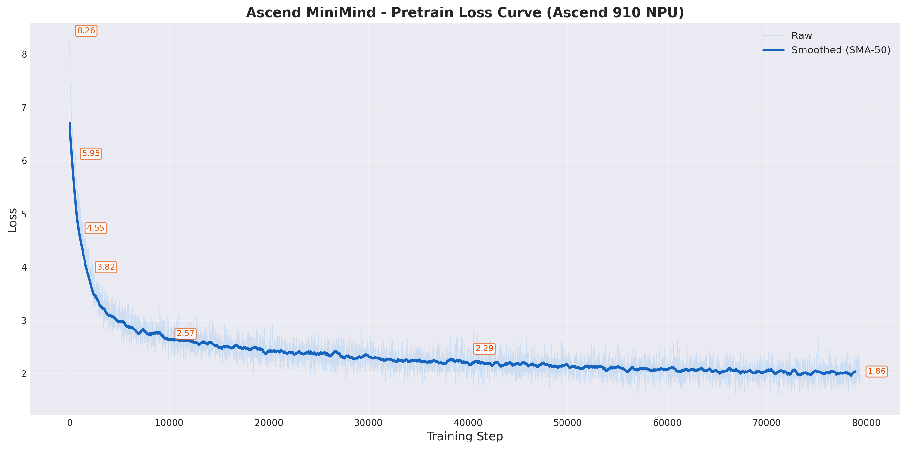

# Ascend MiniMind

> 华为昇腾 NPU 上的轻量 LLM 训练项目，基于 [jingyaogong/minimind](https://github.com/jingyaogong/minimind) 适配，深度集成华为 NPU 融合算子

将 64M 参数的小型语言模型训练流水线完整迁移至 **Ascend 910 NPU**，支持 Pretrain → SFT → DPO → PPO/GRPO → Agent RL 完整训练管线。

## 训练进度

| 阶段 | 状态 | Loss |
|------|------|------|
| ✅ 预训练 (Pretrain) | **已完成** (79390 steps) | **1.86** |
| ⏳ SFT 指令微调 | 待运行 | — |
| ⏳ LoRA 微调 | 待运行 | — |
| ⏳ DPO 偏好对齐 | 待运行 | — |
| ⏳ GRPO 强化学习 | 待运行 | — |
| ⏳ Agent 工具调用 | 待运行 | — |



## 环境

- 2× Ascend910 NPU（64GB HBM / 卡）
- CANN 8.5 + PyTorch 2.7 + torch_npu 2.7
- Python 3.11

```bash
pip install -r requirements.txt
```

## 快速开始

```bash
# 下载数据
python scripts/download_data.py --include-advanced

cd trainer

# 预训练
python train_pretrain.py --batch_size 32 --epochs 2

# 指令微调
python train_full_sft.py --from_weight pretrain --batch_size 16 --epochs 2

# DPO 偏好对齐
python train_dpo.py --from_weight full_sft --batch_size 4

# GRPO 强化学习
python train_grpo.py --from_weight full_sft --batch_size 2 --num_generations 6

# 推理
cd .. && python eval_llm.py --weight full_sft

# 基准测试
python scripts/benchmark_npu.py --bench_inference 1
```

## 文档

| 文档 | 说明 |
|------|------|
| **[TUTORIAL.md](./TUTORIAL.md)** | 完整教程（环境→数据→预训练→SFT→RL→推理） |
| **[SESSION_HANDOVER.md](./SESSION_HANDOVER.md)** | 任务交接（当前状态、已知问题、下一步） |

## 与原始版差异

| 项目 | MiniMind | Ascend MiniMind |
|------|----------|-----------------|
| 设备 | CUDA only | **NPU + CUDA** 自动适配 |
| AMP | `torch.cuda.amp` | `torch.npu.amp` / `torch.cuda.amp` |
| 分布式 | NCCL | **HCCL**（NPU）/ NCCL |
| 训练管线 | Pretrain→SFT→LoRA | Pretrain→SFT→LoRA→**DPO→PPO/GRPO→Agent** |
| 融合算子 | 无 | **npu_fusion_attention** / npu_apply_rotary_pos_emb / fast_gelu |
| 适配层 | 无 | `trainer/huawei_adapter.py`（设备无关，~60行） |
| 数据下载 | 手动 | **ModelScope 一键下载脚本** |

## 模型架构

- 64M 参数 LLaMA-like Decoder-Only
- GQA (8 Q-heads, 4 KV-heads), RoPE, SwiGLU
- 可选 MoE（198M-A64M，单 token 激活 64M）
- 6400 BPE 词表（含中英文）

## 项目结构

```
huawei-minimind/
├── model/                    # 模型定义
│   ├── model_minimind.py     # 主模型 (63.9M)
│   ├── model_lora.py         # LoRA 实现
│   ├── npu_model.py          # NPU 融合算子注入层
│   └── tokenizer.*           # BPE 分词器 (6400)
├── dataset/
│   └── lm_dataset.py         # 6 类数据集 (Pretrain/SFT/DPO/RLAIF/Agent)
├── trainer/
│   ├── huawei_adapter.py     # NPU 设备适配层
│   ├── npu_optimizer.py      # NPU 融合算子封装 + 自动回退
│   ├── rollout_engine.py     # Rollout (Torch/SGLang 双后端)
│   ├── train_pretrain.py     # 预训练
│   ├── train_full_sft.py     # 指令微调
│   ├── train_lora.py         # LoRA 微调
│   ├── train_dpo.py          # DPO 偏好对齐
│   ├── train_ppo.py          # PPO 强化学习
│   ├── train_grpo.py         # GRPO 强化学习
│   ├── train_agent.py        # Agent 工具调用训练
│   └── trainer_utils.py      # 训练工具
├── scripts/
│   ├── download_data.py      # ModelScope 数据下载
│   └── benchmark_npu.py      # NPU 性能基准测试
└── eval_llm.py               # 推理对话脚本
```
